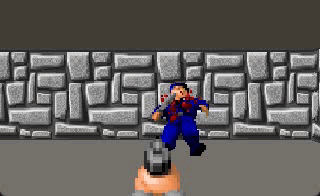
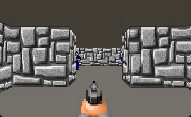
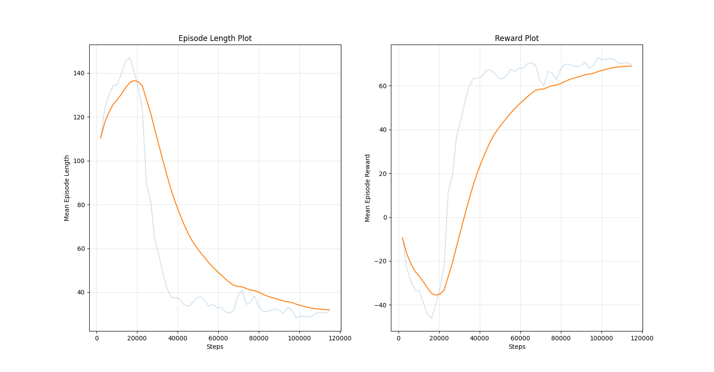
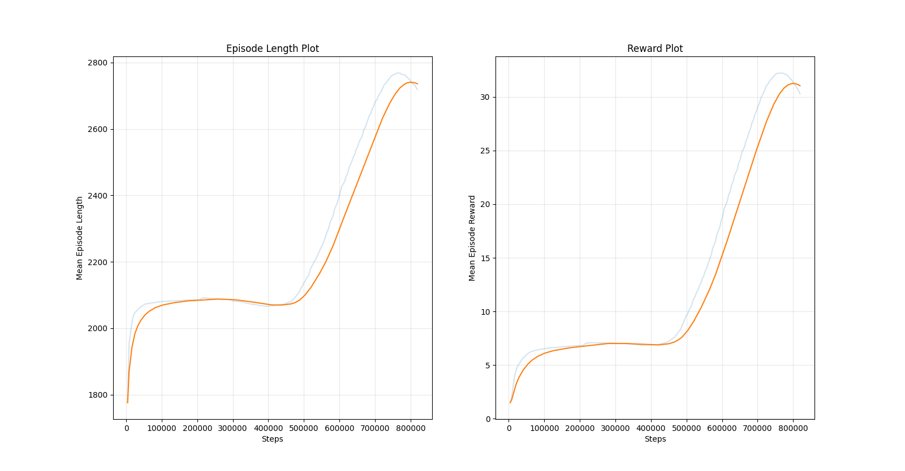
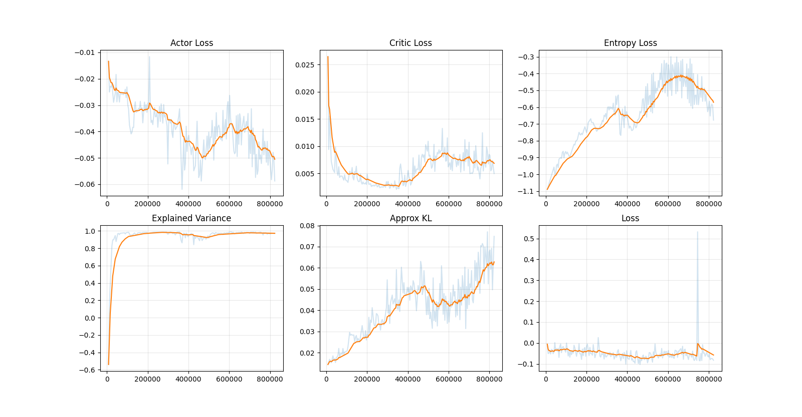
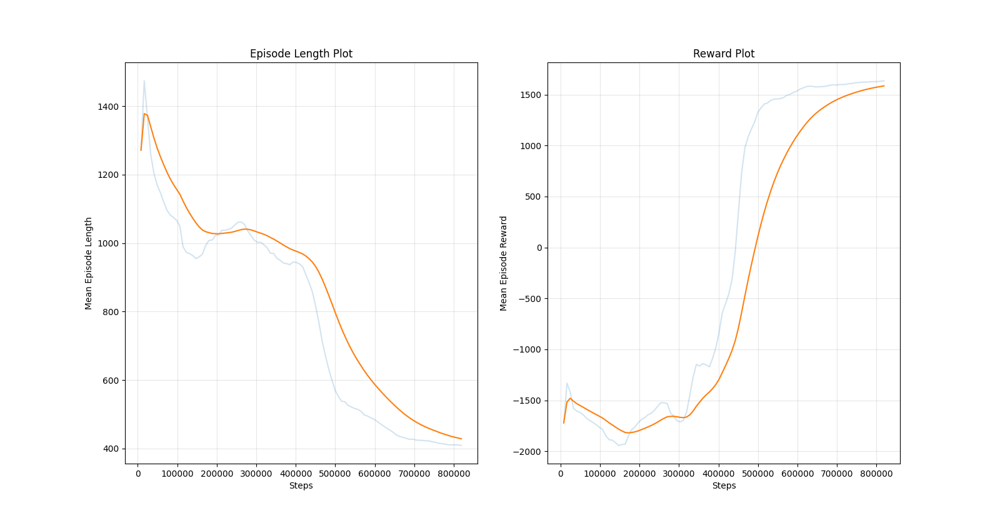

# Self Learning Agent in FPS Environment - RL

Simple implementation of **RayCasting Algorithm** integrated with _Proximal Policy Optimization ( PPO )_ Deep RL Learning Technique.

## Levels:

1. Basic
2. Defend The Center
3. Deadly Corridor

## Modes:

1. Train ( Training The Model )
2. Test ( Testing The Model )

## Deadly Skills:

1. Easy → 1
2. Medium → 2
3. Hard → 3
4. Insane → 4

## Results:

### Basic Level:



### Defend Level:


### Deadly-Corridor Level w/ Sparse Reward:



### Deadly-Corridor Level w/ Reward Shaping & Curriculum Learning:


## Plots:

## Basic



<p align=center>
    <em>Fig: Basic Level Episode Length & Reward Plot</em>
</p>


<p align=center>
    <em>Fig: Basic Level Loss Plot</em>
</p>

## Defend



<p align=center>
    <em>Fig: Defend Level Episode Length & Reward Plot</em>
</p>



<p align=center>
    <em>Fig: Defend Level Loss Plot</em>
</p>

## Deadly



<p align=center>
    <em>Fig: Deadly Level Episode Length & Reward Plot</em>
</p>


<p align=center>
    <em>Fig: Deadly Level Loss Plot</em>
</p>

## CLI Commands:

### Basic & Defend:

### 1. Train Model:

```bash
python3 ./main.py --level { basic | defend } --train
```

### 2. Test Model:

```bash
python3 ./main.py --level { basic | defend } --test --steps { steps }
```

### Deadly:

### Valid Skill Level:

1. Easy
2. Medium
3. Hard
4. Insane

### 1. Train Model w/o Curriculum Learning:

```bash
python3 ./main.py --level defend --train --skill { skill }
```

### 2. Train Model w/ Curriculum Learning:

```bash
python3 ./main.py --level defend --train --skill { skill } --curr
```

### 3. Testing Model:

```bash
python3 ./main.py --level defend --test --skill { skill } --steps { steps }
```

## Valid Level Mode Command:

1. --level basic --train
2. --level basic --test --steps { steps }
3. --level defend --train
4. --level defend --test --steps { steps }
5. --level deadly --train --skill { skill }
6. --level deadly --train --skill { skill } --curr
7. --level deadly --test --skill { skill } --steps { steps }

## Examples:

### 1. To _train_ the model on basic level:

```bash
python3 ./main.py --level basic --train
```

### 2. To _test_ the model trained for _200000_ steps on _DEFEND_ level:

```bash
python3 ./main.py --level defend --test --steps 200000
```

### 3. To _train_ the model on _DEADLY_ level on _medium_ mode w/o Curriculum Learning:

```bash
python3 ./main.py --level deadly --train --skill 2
```

### 4. To _train_ the model on _DEADLY_ level on _hard_ mode w/ Curriculum Learning:

```bash
python3 ./main.py --level deadly --train --skill 3 --curr
```

### 5. To _test_ the model trained for _70000_ steps on _DEADLY_ level on _EASY_ mode:

```bash
python3 ./main.py --level deadly --test --skill 1 --steps 700000
```

_Note: Curriculum Learning is only available if a model has been trained on the previous difficulty mode i.e. Curriculum Learning on Hard mode is only available if a model is available for Medium mode._
